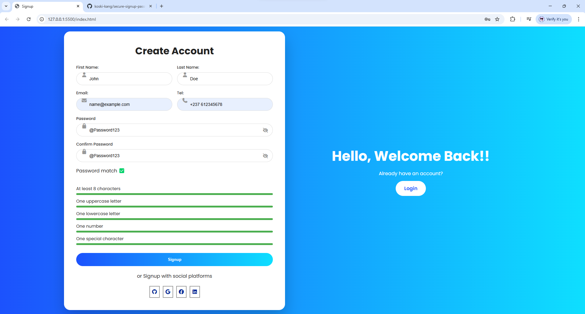

# Secure Signup Password Validator

A modern signup form with real-time password strength validation and visual feedback.

## Features
- Real-time password validation
- Visual progress bars for each rule
- Password visibility toggle
- Submit button enabled only enabled when all rules pass
- Clean, responsive UI
- Smooth animations and transitions

## Password Rules
- Minimum 8 characters
- At least one uppercase letter
- At least one lowercase letter
- At least one number
- Atleast one special character

## Built With
- HTML5
- CSS3 (Grid, Flexbox)
- Vaniulla JavaScript

## Preview

## How to Run
1. Clone  the repository 
    ´´´bash
    git clone https://github.com/koski-kang/secure-signup-password-validator.git
2. Open index.html in your browser

## What I Learned
- Real-time form validation
- Regex-based password checks
- UX-focused security feedback
- Structuring clean front-end projects

## Future Improvements
- Password strength label (Weak/ Medium/ Strong)
- Comparring password entry to a database of leaked password to provide added security 